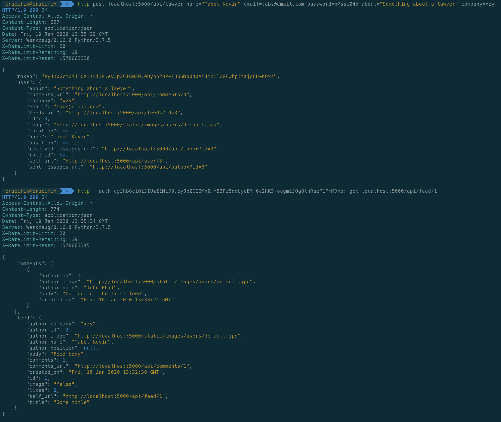
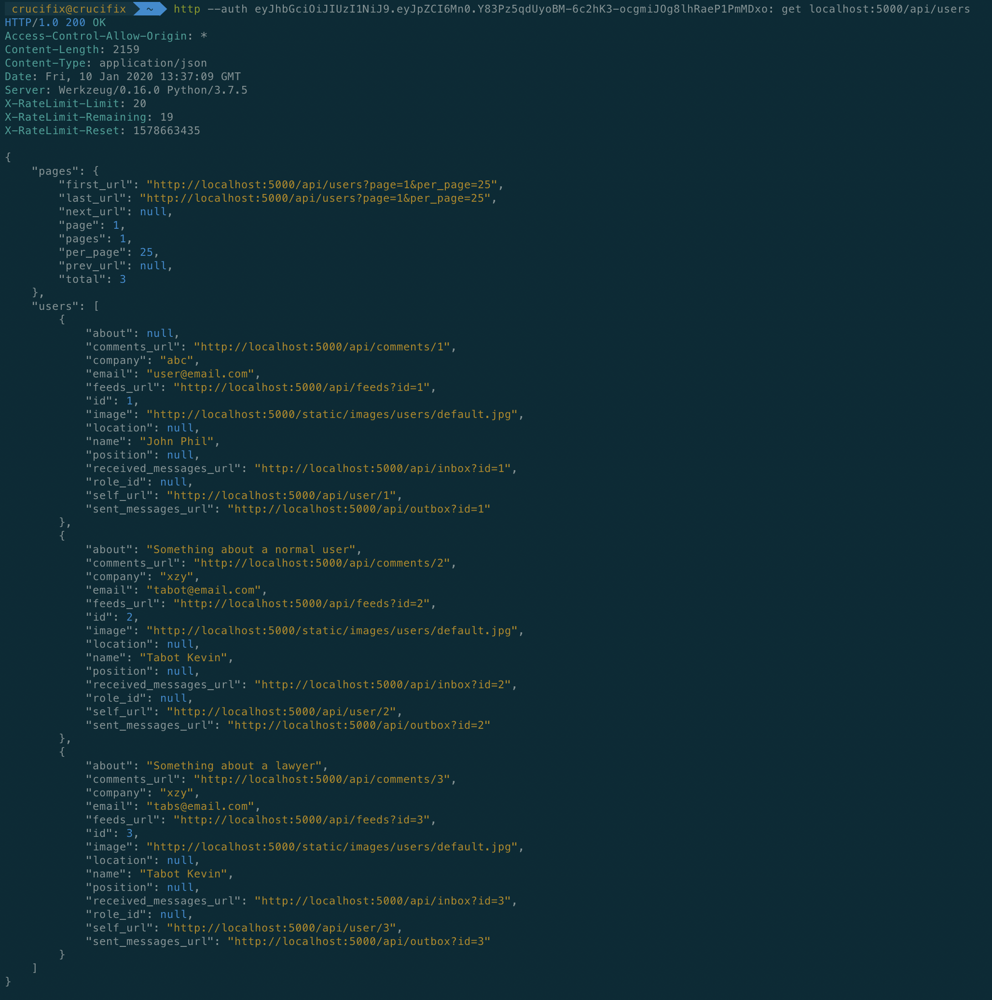
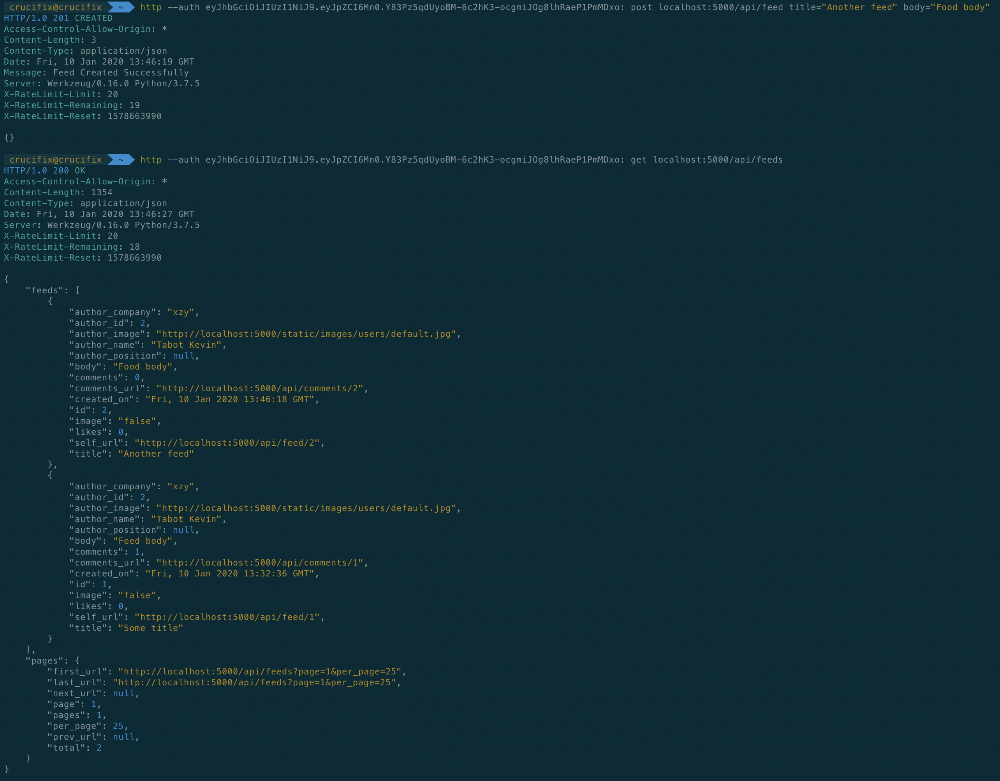
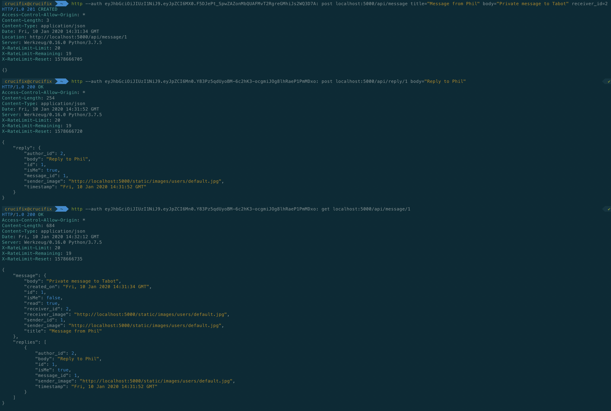

Lawin
----------------------------

# Backend API written in Python using Flask Framework

## A simple social media application for Lawyers to post updates and clients to comment, like and message them directly.

How do I get set up
----------------------------

* Environment Setup
	- $ python3 -m venv venv
	- $ source venv/bin/activate

* Install Dependencies
	- $ pip install -r requirements.txt

* Database configuration 
	- $ python manage.py db init 
	- $ python manage.py initdb 
	- $ python manage.py db migrate 
	- $ python manage.py db upgrade

* Start up the Server
	- $ python run.py

* Main Routes for the projects are stored in the app/api directory under seperate filenames for each module
* To play around a little bit e.g register new users and login using httpie (http) python client
	- $ pip install httpie (After installation you should have http as command on your computer)
	- $ http post localhost:5000/api/user first_name=tabot last_name=kevin email=user@email.com password=password
	  (The Above command will register a new user and return the user info in json)
	- $ http post localhost:5000/api/login email=user@email.com password=password
	(The Above command will login a new user and return the user info in json including an auth token use to interacted locked routes)
	- $ http --auth token: [method] localhost:5000/api/[secured_rooute]
	(To access any secured route use the token gotten from login and dont forget to use colon after the token e.g)
	- $ http --auth eyJhbGciOiJIUzI1NiJ9.eyJpZCI6M30.0Uybn2UP-TBU5No040Ai4jnHl2GBwhpTMajgQU-n0xs: get localhost:5000/api/users (Get all users)
	- $ http --auth eyJhbGciOiJIUzI1NiJ9.eyJpZCI6M30.0Uybn2UP-TBU5No040Ai4jnHl2GBwhpTMajgQU-n0xs: get localhost:5000/api/feeds (Get all feeds)
	- $ http --auth eyJhbGciOiJIUzI1NiJ9.eyJpZCI6M30.0Uybn2UP-TBU5No040Ai4jnHl2GBwhpTMajgQU-n0xs: get localhost:5000/api/feed/1 (Get a single feed with id 1)
	- $ http --auth eyJhbGciOiJIUzI1NiJ9.eyJpZCI6M30.0Uybn2UP-TBU5No040Ai4jnHl2GBwhpTMajgQU-n0xs: post localhost:5000/api/feed title="Some title" body="Feed body" (New feed)

Proof
----------------------------

Who do I talk to
----------------------------
* Repo owner or admin (Tabot Kevin | tabot.kevin@gmail.com)